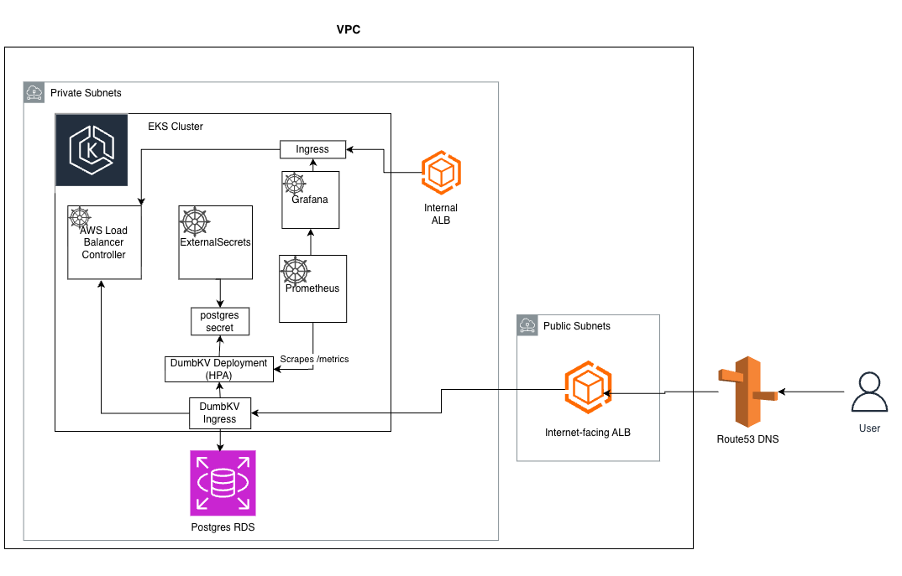

# Architecture Specification

This document proposes the architectural approach to take for hosting the DumbKV application at scale. This includes an architecture diagram as well as details for how it could be expanded to multi-tenancy SaaS.

**Notes**:
* Application Load Balancers are provisioned and managed by the AWS Load Balancer Controller based on Kubernetes Ingress resources, and route traffic to the appropriate Services within the cluster.
* Grafana is exposed via an internal ALB and is not publicly accessible. Access would be restricted through VPN, bastion host, or SSO to reduce attack surface.
* Prometheus is a single point of failure in this design. In production, a highly available setup using Thanos, Cortex, or a managed Prometheus service would be used to provide redundancy and long-term metric storage.
* Grafana is similarly a single instance.
* The Postgres RDS instance should be configured for Multi-AZ deployment to ensure high availability and failover capability.
* An HPA for the DumbKV itself will increase scalability and redundancy, it's also worth mentioning that the mode of providing the compute (EKS nodegroups/Karpenter) would be expected to provide cross-AZ instances for better redundancy as well.

While this implementation uses AWS EKS, this may be considered more complex than necessary for a single-service deployment.

A simpler alternative would be to use AWS ECS, which offers:
- Lower operational overhead
- Reduced cost
- Simpler deployment model

However, EKS was chosen for the following reasons:

- **Extensibility**: The platform is expected to evolve toward a multi-tenant SaaS architecture, where Kubernetes provides stronger primitives for isolation (namespaces, RBAC, network policies).
- **Observability Integration**: Native compatibility with tools like prometheus and grafana.
- **Scalability**: Easier horizontal scaling and workload segmentation as the system grows.

In a production environment, the choice between ECS and EKS would depend on the expected growth trajectory, team expertise, and cost constraints.

## Multi-Tenancy Considerations

The current architecture supports a single-tenant deployment model. To evolve this system into a multi-tenant SaaS platform, the following changes would be implemented:

### Tenant Isolation
- Each tenant would be isolated within its own Kubernetes namespace
- RBAC policies would be scoped per namespace to restrict access between tenants
- NetworkPolicies would enforce communication boundaries between namespaces

### Data Isolation
- Depending on scale and compliance requirements, one of the following strategies would be used:
  - Shared database with tenant identifiers (lowest cost, lowest isolation)
  - Separate schema per tenant (balanced approach)
  - Dedicated database per tenant (highest isolation, highest cost)

### Resource Management
- Resource quotas and limits would be enforced per namespace to prevent noisy neighbor issues
- Horizontal Pod Autoscaling (HPA) could be tuned per tenant for workload-specific scaling

### Observability
- Metrics would include tenant-level labels to enable per-tenant SLIs and alerting
- A shared, production-grade Prometheus and Grafana stack would be used for centralized monitoring

These changes allow the system to scale while maintaining strong isolation, security, and observability guarantees across tenants.